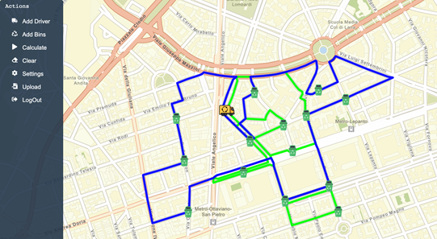
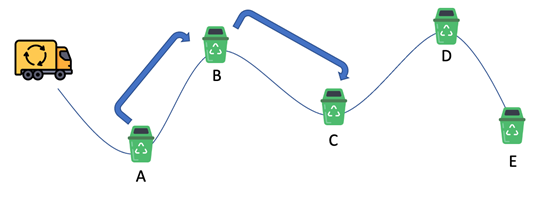
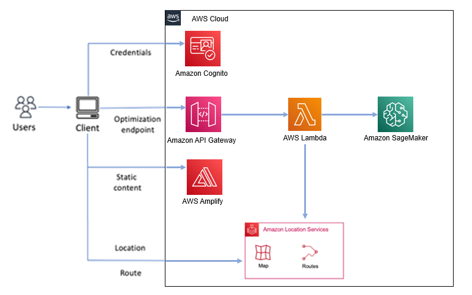
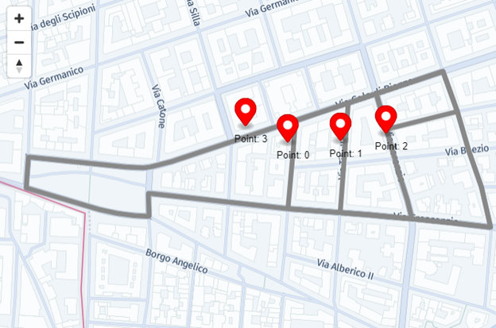
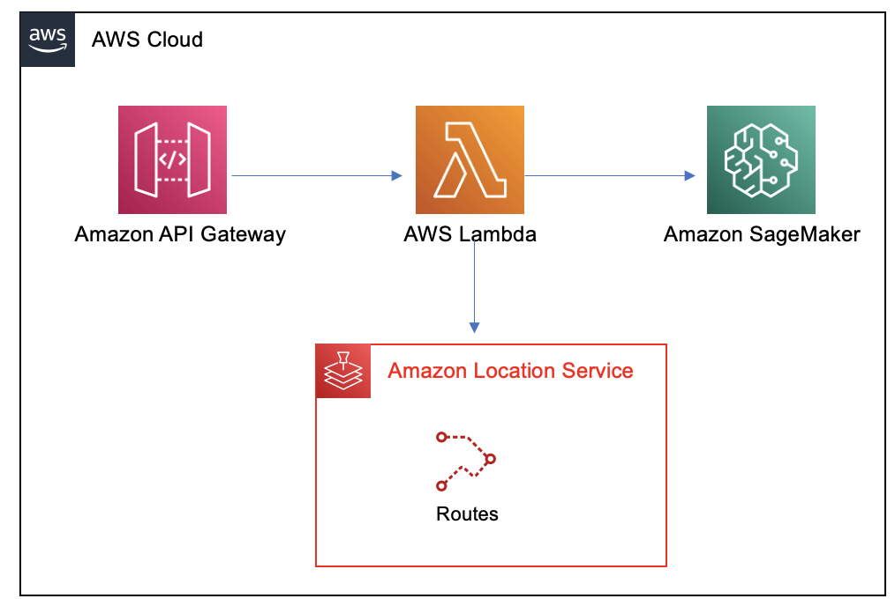

# Optimize Waster collection with Amazon Location Services and Amazon SageMaker 

## Routing optimization for waste bin collection
In everyday life we often use routing services to get directions on how to get from point A (i.e. home) to point B (i.e. work). Behind the scenes of these services, there are algorithms that calculate the best way to reach point B from point A and provide with the best route depending on the mode of transportation, traffic conditions and many other parameters.  

[Amazon Location Service](https://aws.amazon.com/location/) has released a feature that allows you to define a list of routes from a set of starting points to a set of destination points. This list is used as input for a route planning algorithm. A route planning algorithm is the process of computing the most effective path from one place to another through several stops. Logistics, transport and deliveries companies use route planning software to compile the required routes.  

This blog post will show how to use Amazon Location Service and an optimization algorithm to find the most efficient route for a waste collection optimization problem. Waste collection is the transfer of waste from the point of disposal to the point of treatment. This transfer is typically done using garbage trucks. 


## Security

See [CONTRIBUTING](CONTRIBUTING.md#security-issue-notifications) for more information.

## License

This library is licensed under the MIT-0 License. See the LICENSE file.


## What we are going to build.
In this post we will describe how to build a web application to help optimize routing for garbage collection across the city with an interactive GUI. You will define the starting point of the garbage trucks, the location of the bins, the number of trucks in the fleet and their dimensions with just few clicks on the map displayed on your browser.

Before building the front end, you will build and test the back end with the optimization algorithm using [Amazon SageMaker](https://aws.amazon.com/sagemaker/?nc2=h_ql_prod_ml_sm). The algorithm optimizes routes of all trucks according to the following constraints:  
*	the current traffic status.  
*	a truck can only travel roads suitable for the vehicle (height, width and mass).  
*	the maximum capacity represented as number of trash bins that can be collected by a single truck
*	all trucks at the end of the garbage collection process should return to the starting point where the garbage disposal center is located.

The optimal routes will then be displayed back on our GUI to receive feedback over the output of the optimization process.  

   

**Figure 1 – Application Screenshot showing route optimization outcome**


## Solution Overview
Route planning is not as simple as planning a route from point A to point B, this was discussed in a previous blog post [Amazon Location Service enables Matrix Routing to optimize route planning](https://aws.amazon.com/it/blogs/mobile/amazon-location-service-enables-matrix-routing-to-optimize-route-planning/). Routes may have multiple points of departure, such as point A and B, and multiple destinations positions, such as X and Y. To plan and optimize routes from A and B to X and Y, you will need the travel time and travel distance for all of the potential routes within the matrix. The calculation of time, or distance, between each combination of points makes up a **route matrix**.      

To leverage the Matrix Routing feature to solve your problem, you will consider each bin both as an end-point of a hop and also as a starting-point for the next hop.  


**Figure 2 – Bins are both start and end point in this complex routing problem**

This enables you to retrieve all possible distances from any one bin to all the others. As you can see the size of the problem already starts to increase: if you have a home location and 9 bins then you get a 10 x 10 Routing Matrix (100 values). SageMaker can help build the algorithm and deploy it as a serverless inference end-point by also enabling a pay-per-use cost model for our application.  

The overall architecture you will build is described below:  
 
  

**Figure 3 – Overall architecture**

The complete architecture is dived in three parts loosely coupled.

1. The front-end is a React Application that leverages [AWS Amplify](https://aws.amazon.com/amplify/?nc=sn&loc=1) client libraries to connect to AWS services. You can pin bins and the truck deposit on the map, send the coordinates to the AWS Lambda function and draw the optimal path on the map after receiving the optimal routes.  

2.  The Lambda function interacts with Amazon Location passing the coordinates of the bins and getting the route matrix. Then it sends the route matrix to a SageMaker endpoint where the algorithm calculates the optimal route for all the trucks and returns all the routes back to the Lambda function.  

3.  The route geometries are sent back to the browser for visualization on the map.  

You will deploy the components using two [AWS CloudFormation](https://aws.amazon.com/cloudformation/) templates:
*  **setup_environment.yaml**   - creates the Amazon Location services and the associated policy  
*  **api_gateway_template.yaml**  - creates the Amazon API Gateway, the Lambda function and Amazon Cognito identity pool for unauthenticated access to Amazon Location.  


## Amazon Location and Amazon SageMaker  
The problem you are going to solve is a capacity constrained [Vehicle Routing Problem](https://en.wikipedia.org/wiki/Vehicle_routing_problem). It is similar to a travelling salesperson problem (TSP) with some differences. There are more than trucks that are going to be used to cover all the bins and each truck has a limited capacity in terms of bins that it can collect.  
This algorithm is NP hard ([non-deterministic polynomial-time](https://en.wikipedia.org/wiki/NP_(complexity)) hardness), that means that the computational effort needed to find the best solution grows exponentially with the number of bins to be collected. To be able to solve this problem, a set of different algorithms and libraries have been developed in order to find a sub-optimal solution in a reasonable amount of time.  
To keep the implementation of the solution simple we will use [Google Optimization Tools](https://developers.google.com/optimization) (a.k.a., OR-Tools). It is an open-source, fast and portable software suite for solving combinatorial optimization problems. OR-Tools are written in C++, but they provide **wrappers in Python**, C# and Java.  

Before designing and coding the web application, let’s take some time to experiment with Amazon Location and the vehicle routing algorithm using an Amazon SageMaker Studio Notebook.  


### Set up the environment  
In this post you will use CloudFormation to build a SageMaker Studio environment and create the following resources:
-	SageMaker Studio Domain to build and deploy the optimization algorithm and experiment with Location services
-	Location service Map service to interact with maps
-	Location service Routing service to compute routes
-	Provide the right grants to SageMaker to access to the former services.


The CloudFormation template used in this step is named setup_environment.yaml and can be downloaded from [here](https://raw.githubusercontent.com/aws-samples/wastecollector-planner/main/CFTemplate/setup_environment.yaml).
In order to deploy CloudFormation template you can use the AWS Console using this [link](https://us-east-1.console.aws.amazon.com/cloudformation).  
This will open a new window in your browser similar to Figure 4:  
#####################################################  
ADD IMAGE HERE
#####################################################    
**Figure 4 – AWS CloudFormation Console**  

You can now click on **Create stack**, in the next form select **Upload a template file** and use the **Choose file button** to upload the previously downloaded template.
Then click **Next** and fill **Stack name** field with: **LocationServiceDemo** and leave all other Parameters to their default values.
Select  **Next** and **Next** again and in the last screen acknowledge that CloudFormation is going to create AWS Identity and Access Management (IAM) resources as shown in Figure 5 and then click **Submit**.
#####################################################  
ADD IMAGE HERE
##################################################### 
**Figure 5 –CloudFormation acknowledge IAM resource creation**  

Wait until the CloudFormation stack creation process completes. At the end you will see something similar to Figure 6.
#####################################################  
ADD IMAGE HERE
##################################################### 
**Figure 6 – AWS CloudFormation check completion**  

After the stack creates all the resources you can access SageMaker Studio using this [link](https://us-east-1.console.aws.amazon.com/sagemaker/home?region=us-east-1#/studio) and in the console you see your resources similar to Figure 7.  
#####################################################  
ADD IMAGE HERE
##################################################### 
**Figure 7 – Amazon SageMaker Studio console**  

Here you can click on **MyDomain** and this is going to open a new window listing the available users in the domain. In order to open SageMaker Studio environment, select **Launch** and then **Studio** as shown in Figure 8.  
#####################################################  
ADD IMAGE HERE
##################################################### 
**Figure 8 – Amazon SageMaker Studio open user console**  

Now that you have opened SageMaker Studio you will use the included feature to clone the repository https://github.com/aws-samples/wastecollector-planner by clicking on the git icon on the left, selecting **Clone Repository** on the left panel, typing the repository name in the combo box and selecting the hint provided by the combo “Clone https://github.com/aws-samples/wastecollector-planner" and then pressing the button **Clone** as shown in Figure 9.
#####################################################  
ADD IMAGE HERE
##################################################### 
**Figure 9 – Amazon SageMaker Studio cloning github repository**  

Browse the SageMaker Notebook local folders using the panel on the left and open the notebook used for experimenting with Amazon Location. 
The notebook is located in **wastecollector-planner/SageMaker/Using Sagemaker-OR-Tools.ipynb**. Double-click on it.
You will be prompted to select the kernel to be used for this notebook and the **Datascience** kernel will already be selected, if not browse in the list of available kernels and select **Datascience**. Now the notebook will open showing all steps described hereafter. You can execute the steps by clicking on the play icon in the Notebook’s tool bar.

After installing all the required libraries on your Notebook, you are going to deploy a SageMaker inference endpoint to invoke OR-Tools from inside the notebook to test them and also to expose them as a service to be invoked from outside the notebook.
To build an inference endpoint in SageMaker, go through steps in the notebook to build and test the estimator and deploy it with an interface endpoint. 

OR-Tools does not need a training phase, at least when dealing with a small number of items included in the path. You can start to find the optimal route considering a random initialization, so you can build a SageMaker Model ready to be deployed. You just need to provide SageMaker Model with an algorithm using a container and initial weights generated during the training phase, an empty file in our example.


### Building Sagemaker Model  
In order to set-up the container that includes our algorithm you are going to use a “use-your-own-script” [approach](https://aws.amazon.com/it/blogs/machine-learning/bring-your-own-model-with-amazon-sagemaker-script-mode/). This approach leverages existing containers prepared by Amazon, for most common frameworks like Tensorflow, Pythorch, Mxnet, SKLearn, by passing to them a custom script containing the algorithm and an additional file (requirements.txt) with a list of libraries.

In this example, you are going to use a [SKLearn](https://docs.aws.amazon.com/sagemaker/latest/dg/pre-built-docker-containers-scikit-learn-spark.html) container. For this specific example you do not need to use a predefined initial condition for your route optimization problem and since you do not need to run a training phase, you will build a dummy training output file, upload it to Amazon Simple Storage Service (Amazon S3) and build your model by calling SKLearnModel object. 

```
from  sagemaker.sklearn.model import SKLearnModel
modelName=f"RouteOptimiser-{timestamp}"
sklearn_preprocessor = SKLearnModel(
    role=role,
    predictor_cls  = sagemaker.predictor.Predictor,
    sagemaker_session = sagemaker_session,
    name=modelName,
    model_data=f"s3://{bucket}/{prefix}/{timestamp}/model.tar.gz",
    source_dir = 'scripts-or-tools',
    entry_point= 'algorithm.py',
    framework_version ='0.23-1'
)
```


### Deploy the SageMaker model  
Once the model is ready, you will deploy a SageMaker Serverless [Inference end-point](https://aws.amazon.com/it/blogs/aws/amazon-sagemaker-serverless-inference-machine-learning-inference-without-worrying-about-servers/) providing information about the amount of memory you would allocate for it and the maximum number of concurrent calls you would be able to support. You also want the endpoint to use json as the input and the output data format.  
```
from sagemaker.serverless import ServerlessInferenceConfig
from sagemaker.serializers import JSONSerializer
from sagemaker.deserializers import JSONDeserializer

# Create an empty ServerlessInferenceConfig object to use default values
serverless_config =  ServerlessInferenceConfig(
          memory_size_in_mb=4096,
          max_concurrency=10)

predictor=sklearn_preprocessor.deploy(
    serverless_inference_config=serverless_config,
    serializer=JSONSerializer(content_type='application/json'),
    deserializer=JSONDeserializer(accept='application/json'))
```
 

### Testing your algorithm 

The algorithm is now ready to be used by the frontend application. Let’s test it before deploying. You will instruct SageMaker to run Amazon Location, which is going to generate test data to visualize the result. You will use the Amazon Location Route Calculator and the Amazon Location Map service that the initial CloudFormation stack created. The next snippet of code is going to automatically retrieve this information from the stack output:
```
import time
cf=boto3.client ('CloudFormation')
stackName='provalocation'
response = cf.describe_stacks( StackName=stackName) 

while response['Stacks'][0]['StackStatus'] == 'CREATE_IN_PROGRESS':
    time.sleep(10)
    response = cf.describe_stacks( StackName=stackName) 
    print (response['Stacks'][0]['StackStatus'])
response['Stacks'][0]['StackStatus']   
for output in response['Stacks'][0]['Outputs']:
    if output['OutputKey']=='CalculatorName':
        locationCalculatorName=output['OutputValue']
    if output['OutputKey']=='MapName':
        locationMapName=output['OutputValue']
```

You are now ready to leverage Location services to obtain a Route Matrix. You can specify additional constraints that the service has to take into account, i.e. the size of your truck, making sure you are not going through too small streets, the weight and other attributes. Every point is going to be a starting point and an endpoint of a hop in your Route Matrix.
```
location=boto3.client('location')
response=location.calculate_route_matrix(
  CalculatorName= locationCalculatorName,
  DepartNow= True,
  DistanceUnit= "Kilometers",
  TravelMode= "Truck",
  TruckModeOptions= {
    'AvoidFerries': True,
    'AvoidTolls': True,
    'Dimensions': {
      'Height': 3.5,
      'Length': 4.95,
      'Unit': "Meters",
      'Width': 1.9,
    },
    'Weight': {
      'Total': 4500,
      'Unit': "Kilograms",
    },
   },
  DeparturePositions=PointOfInterest,
  DestinationPositions=PointOfInterest)
```


After extracting relevant data from the response and putting them in a matrix format, the result will be as follows:
```
array([
  [0, 0.812, 0.731, 0.679],
  [0.824, 0, 0.674, 0.622],
  [0.787, 0.718, 0, 0.263],
  [0.88, 0.963, 1.09, 0],
]);
```


The matrix is not symmetric and this is due to the one-way signs that require different routes: to go from 0 to 3 the distance is 0.67 KM while to go from 3 to 0 it is 0.88 KM.
You can now send the matrix to the Optimization Algorithm to get the best routes. 
```
data = {}
data['distance_matrix'] = DistanceMatrix.tolist()
data['num_vehicles'] = 1
data['depot'] = 0
data['vehicle_capacities']=[20]
```

You will get the following output: [[0, 3, 2, 1, 0]].  
This is an array of a single item. You requested that routes be optimized for a single track, and the result of the output is that you start from point 0 through points 3,2,1 and then back to 0.  
The number that represents each point, can be transformed back into GPS coordinates and displayed on a map.


  
**Figure 10 – Amazon Location Service Map showing routing optimization output**  

### Using Sagemaker Endpoint from external services  
You now need to implement a REST API that helps to expose a service that receives as input the list of locations of garbage bins, and returns the information needed to plot the optimized route on a map. 

The implementation of this service has been done using the following architecture:

  
**Figure 11 – REST API architecture**  


The Lambda function performs all the required preprocessing steps like interacting with Amazon Location to compute the Route Matrix and then invokes a SageMaker endpoint to perform the route optimization. As SageMaker returns the answer, the Lambda function computes the route geometry and forwards them to the API Gateway that returns the response to the caller.

This is what the Lambda function is doing in detail:

1.  Calculate the route matrix starting from parameters passed by the web application

The Lambda function make use of AWS SDK for Javascript V3 and calculate the route matrix starting from parameters passed by the browser and stored into **matrixParams** variable.
```
 try {
      const client = new LocationClient({region: region});
      const command = new CalculateRouteMatrixCommand(matrixParams);
      const routeMatrix = await client.send(command);

      …
     }
catch (err){
      console.error(err);
     }
```
**matrixParams** is a JSON object sent by the web application with all the relevant information to calculate the route matrix.  
```
const options = {
  DepartNow: true,
  IncludeLegGeometry: true,
  DistanceUnit: "Kilometers",
  TravelMode: "Truck",
  TruckModeOptions: {
    AvoidFerries: true,
    AvoidTolls: true,
    Dimensions: {
      Height: 2.5,
      Length: 4.95,
      Unit: "Meters",
      Width: 1.8,
    },
    Weight: {
      Total: 1000,
      Unit: "Kilograms",
    },
  },
  DeparturePositions: [],
  DestinationPositions: [],
};
```
**DeparturePositions** is an array of longitude, latitude of the truck deposit and   
**DestinationPositions** is a matrix with the coordinates of all the bins.

[Here](https://docs.aws.amazon.com/AWSJavaScriptSDK/v3/latest/clients/client-location/interfaces/calculateroutematrixcommandinput.html#departurepositions) the list of all available options such as route preferences, time of departures, truck dimensions.

2.  Calculate the route matrix starting from parameters passed by the web appplication
Invokes the SageMaker endpoint by passing to it the Route Matrix (from point 1) and receiving the optimal routes:  
```
const client = new SageMakerRuntimeClient({ region: region });
const command = new InvokeEndpointCommand(input);
const data = await client.send(command);
var optimal = new TextDecoder().decode(data.Body);
```

3.	With the optimal routes (from point 2), the Lambda function calls Amazon Location to get the route geometry and pass it back to the web application.

Here is the code that demonstrates the call to the CalculateRouteCommand and receives the geometry of the single routes:
```
const client = new LocationClient({region: region});
const command = new CalculateRouteCommand(matrixParams);
const leg = await client.send(command);
```
An IAM role must be in place for the Lambda function to call Amazon Location and SageMaker.  
To deploy the API Gateway, the Lambda function and the related roles, use the [apigateway_template.yaml](https://github.com/aws-samples/wastecollector-planner/blob/main/CFTemplate/apigateway_template.yaml) CloudFormation template.  

To deploy this second CloudFormation template follow the same steps described above for creating setup_environment.yaml. You need to provide the following in inputs: 
* 	the name of the second template: **LocationServiceDemoBackend**.  
*	 the name of the SageMaker Endpoint: you can get it from the Jupyter notebook. There is cell in the notebook that prints the name of the endpoint by executing predictor.endpoint_name.  
* 	the name of the IAM policy that you will used to access Location Services: you can get it from the output of setup_environment.yaml CloudFormation template we used to set-up the environment.  
* 	the name of the Location Service Calculator instance that will be used by the Lambda function: you can get it from the output of setup_environment.yaml CloudFormation template we used to set-up the environment.  
  
Once the CloudFormation template deployment is complete you can get the following values from its output. These values will be used in the web application as described in the next paragraph.  

* 	The url of the REST api  
* 	The Amazon Cognito Identity Pool ID, UserPoolID and AppClientIDWeb that are used by the web appplication


## Building the Web App  
In this section you will build the web application that uses optimization algorithm exposed by SageMaker inference endpoint as described above. The web application uses React and make use of the Amplify Javascript Library and Amazon Location, to display the map on the web page.  

Amplify provides several products to build full stack apps:  

* 	[Amplify CLI](https://docs.amplify.aws/cli/) – A simple command line interface to setup the needed services.  
* 	[Amplify Libraries](https://docs.amplify.aws/lib/q/platform/js/) - Use case-centric client libraries to integrate the front-end code with the backend.  
* 	[Amplify UI Components](https://ui.docs.amplify.aws/) - UI libraries for React, React Native, Angular, Vue and Flutter.  
  
In this example you have already created all the required services with the CloudFormation templates so you will not use the Amplify CLI but only Amplify libraries for Javascript.  

The client code can be downloaded from https://github.com/aws-samples/wastecollector-planner  

In the repository, you will find **aws-exports.js.template**. You need to modify this file with the information collected from the output of the CloudFormation stacks, in order to provide the correct information about endpoint of each service and saved as **aws-exports.js**.  

This is the list of information required:  
*  **aws_project_region** and **aws_cognito_region**: to be filled in with the region in which you run the CloudFormation template (i.e. us-east-1)
* 	**aws_cognito_identity_pool_id**, **aws_user_pools_id**, **aws_user_pools_web_client_id**: you can get this value from the output of apigateway_template.yaml
* 	In the section **geo**:
 *	 **region**: same region as above  
 * 	**default**: update this with the name of Location Map services listed in the output of setup_environment.yaml CloudFormation template  
*	 In the section **API**:  
 * 	endpoint: update this with API gatweway url listed in the output of apigateway_ template.yaml  

You are now ready to run the web app with:
```
npm install
npm run build
npm run start
```

When done, point your browser to:  
```
http://localhost:8080  
```

And have fun!  

## Clean up

To clean up all the resources you have created in this blog post, follow the instructions described at the end of the SageMaker notebook, then delete the two CloudFormation templates.  

