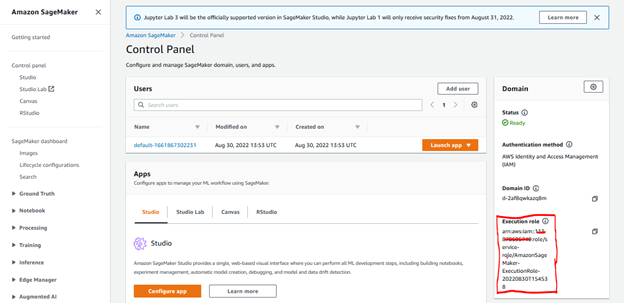
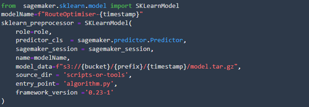

# Routing optimization for waste bin collection 

## Introduction
We usually use routing services to get information on how to get from point A to point B. 
Behind the scenes of these services, there are algorithms that calculate the best way to reach point B from point A and provide with the best route depending on the traffic, diversions and many other parameters.    
Amazon Location Service has recently released a new feature that allows to define a list of routes from a set of starting points to a set of destination points. We will use this feature as an input for the optimization algorithm.  
For more information about this feature, please read this [blog post](https://aws.amazon.com/it/blogs/mobile/amazon-location-service-enables-matrix-routing-to-optimize-route-planning/).  
In this post, we are going to present a practical application of this feature to solve a garbage collection optimization problem.   

## Security

See [CONTRIBUTING](CONTRIBUTING.md#security-issue-notifications) for more information.

## License

This library is licensed under the MIT-0 License. See the LICENSE file, it also includes third party libraries see THIRD-PARTY-LICENSES

## What we are going to build.
We will build a web application to help optimize routing for garbage collection across the city with a cool interactive GUI. We will define the starting point of the garbage trucks, the location of the bins and the number of trucks in the fleet and their dimensions.  
Before building the front end, we will build and test the back end with the optimization algorithm using Amazon Sagemaker. The optimization algorithm optimizes the routes of all trucks according to the following constrains:

*	route optimization should take into account current traffic status.
*	maximum capacity represented as number of trash bin that can be collected by a single truck.
*	all trucks at the end of the garbage collection process should return to the starting point where the garbage disposal center is located.

The optimal routes will then be displayed back on our GUI to receive feedback over the output of the optimization process.  

   

**Figure 1- The application**

## Overview of the solution
As mentioned in this [blog post](https://aws.amazon.com/it/blogs/mobile/amazon-location-service-enables-matrix-routing-to-optimize-route-planning/), route planning is not as simple as planning a route from point A to point B. Routes may have multiple points of departure, such as point A and B, and multiple destinations positions, such as X and Y.
To plan and optimize routes from A and B to X and Y, you need the **travel time** and **travel distance** for all of the potential routes within the matrix.  
The calculation of time / distance between each combination of points makes up a **route matrix**.  
To leverage Matrix Routing feature to solve our problem, we consider each bin both as an end point of a hop and also as a starting point for the next hop.  

**Figure 2- Each bin both start and end**

This allows to retrieve all possible distances from any bin to all the others. As you can see the size of the problem already starts to increase: if you have a home location + 9 bins then you get a 10 x 10 Routing Matrix (100 values).  
Amazon Sagemaker can help building the algorithm and deploy it as a serverless inference end-point by also enabling a pay-per-use cost model for our application.

The overall architecture is designed in the picture below:  
  

**Figure 3 - Overall architecture**

The complete architecture is dived in three parts loosely coupled.

1.  The front-end is a React Application that make use of Amplify client
    libraries to interact with AWS services. User can pin bins and the
    truck deposit on the map, sends the coordinates to the Lambda
    function and draw the optimal path on the map after receiving the
    optimal routes.

2.  The Lambda function interacts with Amazon Location Service passing the coordinates of the bins and getting the route matrix. Then it sends the route matrix to Sagemaker endpoint where the algorithm calculates the optimal route for all the trucks and returns all the routes back to the Lambda.

3.  The route geometries are sent back to the browser to be visualized on the map.

## Amazon Location Services and Amazon Sagemaker  
The problem we are going to to solve is a Capacity Constrained [Vehicle Routing Problem](https://en.wikipedia.org/wiki/Vehicle_routing_problem), it is similar to a travelling salesperson problem or TSP with some differences: there’s more than truck that is going to be used to cover all the bins and each truck has a limited capacity in terms of bins that can collect.  
This algorithm is NP hard that means that the computational effort needed to find the best solution grows exponentially with the number of bins to be collected, to be able to solve this problem a set of different algorithms and libraries has been developed in order to be able to find a “sub-optimal” solution in a reasonable amount of time.  
To keep the implementation of the solution simple we will use Google Optimization Tools (a.k.a., OR-Tools). It is an open-source, fast and portable software suite for solving combinatorial optimization problems. OR-Tools are written in C++, but they provide **wrappers in Python**, C# and Java.  
Before designing and coding the web application, let’s take some time to experiment Amazon Location Services and the vehicle routing algorithm using Amazon Sagemaker Studio Notebook.  

### Setting Up Sagemaker Studio Environment  
In this post we assume you already have some experience in setting up and using Amazon Sagemaker Studio and we will describe the configuration activity required. If you need additional information on how to set-up a Amazon Sagemaker Studio environment please see [Onboard to Amazon SageMaker Domain Using Quick setup](https://docs.aws.amazon.com/sagemaker/latest/dg/onboard-quick-start.html)  
The next step is to create the following resources:
*	Location service Map service to interact with maps  
*	Location service Routing service to compute routes  
*	Provide the right grants to Sagemaker to access to the former services.  

To achieve this result, we will run a cloudformation template passing in input the name of the template and the name of the Sagemaker execution role (only the name not the full ARN) that can be found on the bottom left of the screen as shown hereafter.  
  

The cloudformation template can be downloaded from [here](https://gitlab.aws.dev/lfenu/wasterouting/-/blob/master/Sagemaker/API-CFTemplate/setup_environment.yaml) (To be replaced with official https://github.com/aws-samples/xxx  public repo)  

The next step is to open a Studio and leverage the “Git Clone” feature to Clone the repository:  https://gitlab.aws.dev/lfenu/wasterouting.git (To be replaced with official https://github.com/aws-samples/xxx  public repo)  

The notebook used for experimenting with Amazon Location services is: wasterouting/Sagemaker/Using Sagemaker-OR-Tools.ipynb. This notebook includes all the steps described hereafter.  

After installing required libraries on the Notebook instance, we are going to deploy a Sagemaker inference endpoint to invoke OR-Tools both from inside and outside the notebook. To achieve this result we will go through building and testing a estimator and deploying it to an interface endpoint.  

Usually when solving a complex routing problem an initial condition is found performing an extensive search of optimal route and investina a lot of computation time, while the solution for the day to day route is searched starting from this initial contition and taking into account the current status of the roads (man at work, traffic jam, ...), this help reducing the computation needed to find the day by day optimal route. The initial condition search is computed in a training phase, the outcome of this training is later used as starting point for the day by day analysis using inferences.  
In our example we are testing small and always different routing problems and in this case we do not need a training phase, we can simply find the optimal route starting from a random initialization. To do so we can build a Model ready to be deployed by providing Sagemaker Model with an algorithm (a container), and initialization parameters, a dumb file in our example that will be replaced by random initialization at runtime.   

### Building Sagemaker Model  
In order to set-up the container that includes our algorithm we are going to use a “use-your-own-script” approach [here for more details](https://aws.amazon.com/it/blogs/machine-learning/bring-your-own-model-with-amazon-sagemaker-script-mode/). This approach leverages existing containers prepared by Amazon, for most common frameworks like Tensorflow, Pythorch, Mxnet, SKLearn, by passing them a custom script containing the algorithm and an additional file (requirements.txt) with a list of libraries.  

In this example, we are going to use SKLearn container and since for this specific example we do not need to use a predefined initial condition for our route optimization problem we do not need to run a training phase we build a dummy training output file, load it to s3 and build our model by calling SKLearnModel object.  

### Deploy Sagemaker Model  
Once the model is ready, we are going to deploy a Sagemaker Serverless Inference end-point providing information about the amount of memory to allocate and the maximum number of concurrent calls. We also want the endpoint to use json as input and output data format.  
  

### Testing our algorithm  
The algorithm is now ready to be used by the frontend application. Let’s test it before deploying. We will instruct Sagemaker to run Amazon Location Services, which is going to generate test data to visualize the result. Sagemaker will ask Location Service to create a route calculator and a map service for us.  
  
We are now ready to leverage location services to obtain a Route Matrix.  
We can specify additional constraints that the service has to take into account, i.e: the size of our truck, making sure we are not going through too small streets, the weight and other attributes.  
Every point is going to be a starting point and an endpoint of a hop in our Route Matrix.  

  

After extracting relevant data from the response and putting them in a matrix format, we will have:  
    array([  
        [0, 0.812, 0.731, 0.679],  
        [0.824, 0, 0.674, 0.622],  
        [0.787, 0.718, 0, 0.263],  
        [0.88, 0.963, 1.09, 0],  
    ]);  

The matrix is not symmetric and this is due to the one-way signs that require different routes: to go from 0 to 3 the distance is 0.67 KM while to go from 3 to 0 it is 0.88 KM.
We can now send the matrix to the Optimization Algorithm to get the best routes. 

We will get the following output: [[0, 3, 2, 1, 0]]. 
This is an array of a single item. Since we asked to optimize routes for a single track, the meaning of the output is that we start from point 0 through points 3,2,1 and then back to 0. 
The number that represents each point, can be transformed back into GPS coordinates and displayed on a map.

  

### Using Sagemaker Endpoint from external services  
You now need to implement a REST API that helps to expose a service that
recieves as input the list of locations of garbage bins and returns the
information needed to plot the optimized route on a map.

The implementation of this service has been done using the following
architecture:

The Lambda function performs all the required preprocessing steps like interacting with Amazon Location services to compute the Route Matrix and than invokes Sagemaker endpoint to perform the route optimiziation. As Sagemaker returns the answer, the Lambda function computes the route geometry and sends them back to API Gateway that returns the answer to the caller.

We are going to use nodeJS to implement our lambda function and we need to include the latest version of the AWS Javascript SDK. Since this library can be reused by multiple lambda functions we decided to build a custom lambda layer to host that.

You can integrate the lamba layer following the directions described here:

https://aws.amazon.com/premiumsupport/knowledge-center/lambda-layer-aws-sdk-latest-version/

You have to install the following packages as layer:

    npm install @aws-sdk/client-location
    npm install @aws-sdk/client-sagemaker-runtime

This is what the Lambda function is doing in detail:

1.  Calculate the route matrix starting from parameters passed by the web app

The Lambda function make use of AWS SDK for Javascript V3 and calculate the route matrix starting from parameters passed by the browser and stored into matrixParams variable.

    try {
        const client = new LocationClient({region: region});
        const command = new CalculateRouteMatrixCommand(matrixParams);
        const routeMatrix = await client.send(command);
    }
    catch {...}

matrixParams is a JSON sent by the web application with all the relevant information to calculate the route matrix.

    const options = {
        DepartNow: true,
        IncludeLegGeometry: true,
        DistanceUnit: "Kilometers",
        TravelMode: "Truck",
        TruckModeOptions: {
            AvoidFerries: true,
            AvoidTolls: true,
            Dimensions: {
            Height: 2.5,
            Length: 4.95,
            Unit: "Meters",
            Width: 1.8,
            },
            Weight: {
            Total: 1000,
            Unit: "Kilograms",
            },
        },
        DeparturePositions: [[longitude, latitude]],
        DestinationPositions: [[longitude, latitude]],
    };

Where DeparturePositions is an array of longitude, latitude of the truck deposit and DestinationPositions is a matrix with the coordinates of all the bins.

You can find detailed info about all the options at the following link:

<https://docs.aws.amazon.com/AWSJavaScriptSDK/v3/latest/clients/client-location/interfaces/calculateroutematrixcommandinput.html#departurepositions>

2.  Calculate the route matrix starting from parameters passed by the web app

Call the Sagemaker endpoint passing to it the route matrix (from point 1) and getting back the optimal routes:

    try {
        const client = new SageMakerRuntimeClient({ region: region });
        const command = new InvokeEndpointCommand(input);
        const data = await client.send(command);
        var optimal = new TextDecoder().decode(data.Body);
    }
    catch {...}

3.  With the optimal routes (from point 2), Lambda calls Location services to get the route geometry and pass it back to the web app.

Call the CalculateRouteCommand and get back the geometry of the single routes:

    try {
        const client = new LocationClient({region: region});
        const command = new CalculateRouteCommand(matrixParams);
        const leg = await client.send(command);
    }
    catch {...}

A role must be in place for Lambda to call Amazon Location services and
Sagemaker, the role is:

A role must be in place for Lambda to call Amazon Location services and Sagemaker.
The role is created by the first cloudformation template (apigateway_lambda_template.yaml) based on the policy from the first one (setup_environment.yaml).
So, to deploy API Gateway, Lambda function and related roles you can use the apigateway_lambda_template.yaml cloudformation template.

You have to provide in input:

-   the name of Sagemaker Endpoint (we can get it from the Jupyter notebook)

-   the ARN of the Lambda Layer you have already created

-   the name of the policy that shall be used to access Location
    Services (you can get it from the output of the first cloudformation
    template we used to set-up the environment)

-   the name of the Location Service Calculator instace that shall be
    used by the lambda function (you can get it from the output of the first cloudformation
    template we used to set-up the environment).

Once the cloudformation template execution completes we can get the
following values from its output:

-   The url of the REST api we have just built

-   The Cognito Identity Pool ID, UserPoolID and AppClientIDWeb that are used by the web app 

## Building the Web App  
In this section you will build the web app that makes use of the
optimization algorithm exposed by Sagemaker inference endpoint as
described above.

The web app will utilize React and make use of the Amplify Javascript
Library and Amazon Location Services, to display the map on the web
page.

You will not use the Amplify CLI in this project because all the backend
services are created using the CloudFormation templates.

When using the Amplify CLI, the **aws-exports.js** file gets created and updated automatically for you based on the resources you have added and configured. If you are not using the Amplify CLI as in our case, you need to create the file and fill in with data coming from the output of the Cloudformation templates. 

In the repository, you just need to open the file **aws-exports.js.template**, insert with the correct information and
save it as **aws-exports.js**

You are now ready to run the web app with:

    npm install
    npm run build
    nom run start

When done, point your browser to

    http://localhost:8080/

And have fun!

### CODE Walkthrough

The React application make use of:

**Amplify Javascript Library** - open-source client libraries that
provide use-case centric, opinionated, declarative, and easy-to-use
interfaces enabling developers to easily interact with their backends.

<https://docs.amplify.aws/lib/q/platform/js/>

**Amplify UI -** a collection of accessible, themeable, performant React
components

<https://ui.docs.amplify.aws/>

**react-map-gl** -- A react wrapper for Mapbox GL JS Map

<https://visgl.github.io/react-map-gl/>

The client code can be downloaded from
<https://gitlab.aws.dev/lfenu/wasterouting/-/blob/master/Sagemaker/API-CFTemplate/setup_environment.yaml>
(*To be replaced with official <https://github.com/aws-samples/xxx>
public repo)*

## Clean up

To clean up just follow the instruction described at the end of the Sagemaker notebook and the delete the two cloudformation templates.